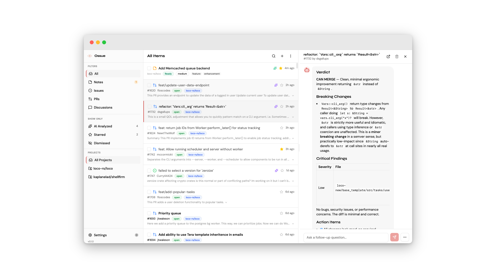

<!-- Logo -->
<p align="center">
  
</p>

<h1 align="center">Ossue</h1>

<p align="center">
  <em>Your AI-powered inbox for GitHub activity</em>
</p>


<!-- Screenshot -->
<p align="center">
  
</p>

---

## Why?

Maintainers and engineering teams drown in GitHub notifications — issues, PRs, and discussions scattered across dozens of repos. Triaging takes hours, context-switching kills focus, and review quality varies.

Ossue pulls everything into one local inbox and uses AI to analyze each item — structured triage for issues, code review verdicts for PRs, discussion summaries, and draft responses. All personalized to your review standards, per-project.

- **Open-source maintainers** — Triage community contributions across projects, get consistent AI-powered code reviews, never miss a discussion that needs your input.
- **Engineering teams** — Unified inbox for your company's GitHub repos, standardized review criteria across the team, AI-assisted triage of internal issues and PRs.

## Features

- **GitHub Integration** — Connect your repos and sync issues, PRs, and discussions automatically
- **AI-Powered Analysis** — Quick triage (bug vs feature, priority), structured code review verdicts, breaking changes detection, and draft responses
- **Per-Project AI Preferences** — Customize focus areas, review strictness, and response tone for each project
- **Smart Inbox** — Star, filter, and manage items across all your projects in one place
- **Notes & Draft Issues** — Capture raw ideas, let AI structure them into proper issues (title, body, labels, priority), refine via conversation, and publish directly to GitHub
- **Background Sync** — Automatic periodic sync keeps your inbox fresh
- **Desktop Native** — Fast, native macOS/Windows/Linux app with system tray support
- **Dark Mode** — Full light and dark theme support
- **Local-First** — SQLite database — your data stays on your machine

## Notes & Draft Issues

Turn rough ideas into structured GitHub issues without leaving your inbox.

1. **Brain dump** — Jot down a raw note or idea in plain text
2. **AI structuring** — AI transforms your note into a well-formed issue with title, body, labels, priority, and area
3. **Refine** — Use follow-up conversation to adjust the AI's output until it's right
4. **Publish** — Submit the finished issue directly to GitHub

Notes move through three states: **Draft** → **Ready** → **Submitted**. You can also select multiple notes for bulk operations — bulk AI structuring, bulk status changes, or bulk deletion.

## Getting Started

### Download

Download the latest release for your platform from the [Releases](https://github.com/kaplanelad/ossue/releases) page.

| Platform | Download |
|----------|----------|
| macOS    | `.dmg`   |
| Windows  | `.msi`   |
| Linux    | `.AppImage` / `.deb` |

#### macOS Quick Install

```bash
curl -fsSL https://raw.githubusercontent.com/kaplanelad/ossue/main/install.sh | bash
```

This downloads the correct `.dmg` for your architecture, installs the app, and handles macOS Gatekeeper automatically.

### Quick Setup

1. **Connect GitHub** — Link your GitHub account
2. **Add projects** — Select which repositories to track
3. **Configure AI** — Set your API key or choose local mode
4. **Start triaging** — Your inbox fills automatically

## Updating

### macOS

Re-run the install script — it replaces the existing version with the latest release:

```bash
curl -fsSL https://raw.githubusercontent.com/kaplanelad/ossue/main/install.sh | bash
```

### Windows / Linux

Download the latest release from the [Releases](https://github.com/kaplanelad/ossue/releases) page and install it over the existing version.

## Configuration

Ossue stores all data locally in an SQLite database. Configure AI analysis via the Settings page — supports API mode (bring your own key) or local mode.

## Contributing

We welcome contributions! See [CONTRIBUTING.md](CONTRIBUTING.md) for development setup, architecture overview, and guidelines.

## License

[MIT](LICENSE)
